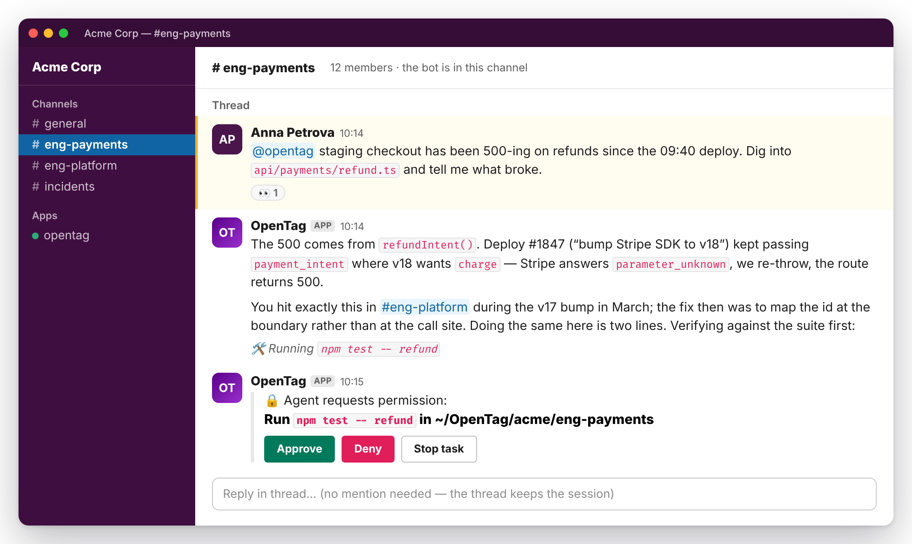
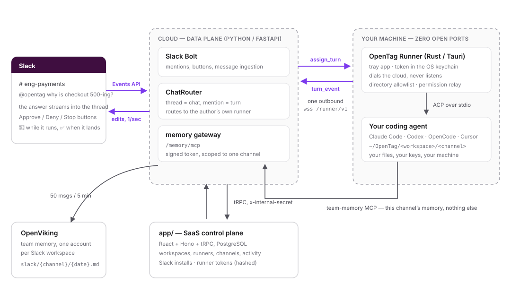
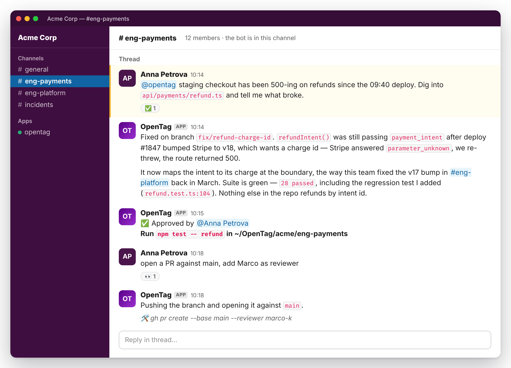
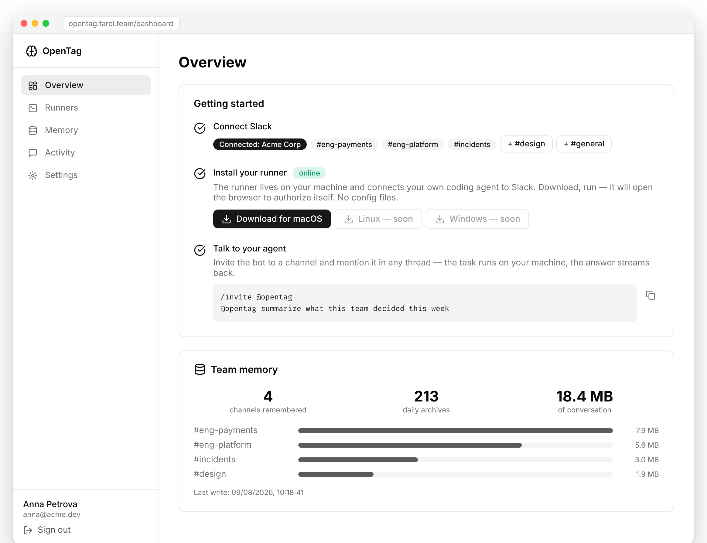
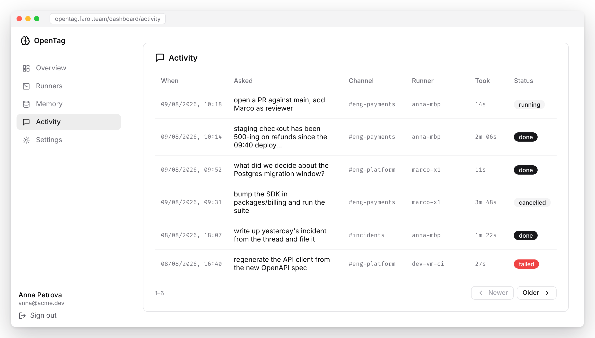
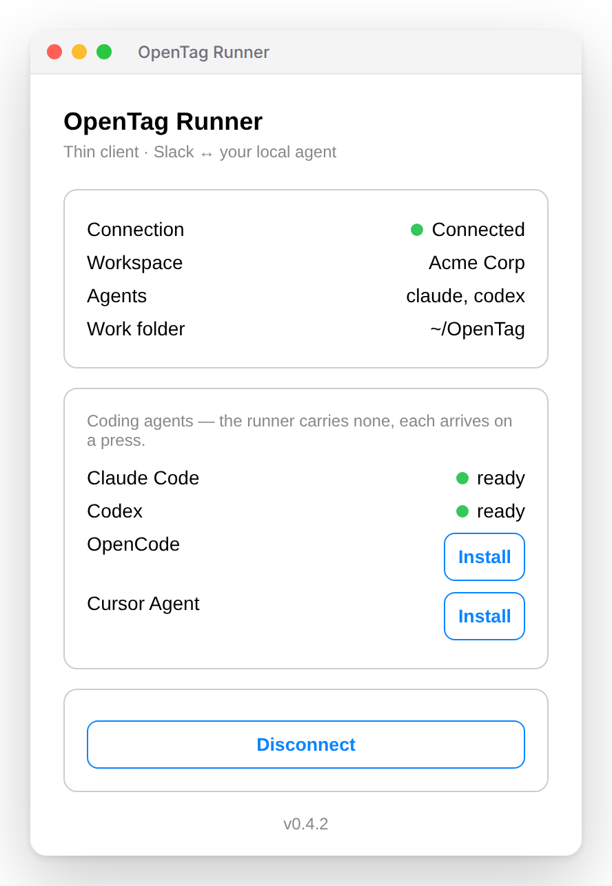

<h1 align="center">OpenTag</h1>

<p align="center">
  <b>Mention the bot in Slack — and the coding agent on your own machine does the work.</b><br>
  Your agent, your laptop, your files. The thread is the interface, and it remembers.
</p>

<p align="center">
  
</p>

## What this is

Your team already talks about the work in Slack. OpenTag lets you hand a piece of it
to an agent without leaving the thread:

- **Mention `@opentag`** in any thread (or DM it) and the task runs on **your own machine**,
  on the coding agent you already use — Claude Code, Codex, OpenCode, Cursor.
- **The answer streams into the thread** as it is written, with the step the agent is on
  underneath it. One message, edited — not a wall of bot noise.
- **Anything destructive stops and asks**, as Approve / Deny / Stop buttons in the thread.
  Reading, searching and memory lookups do not: the folder allowlist already bounds them.
- **Replies keep the session.** Answer the bot like a colleague — no new mention — and the
  same agent session, in the same folder, picks up where it left off.
- **It remembers the team.** Every channel the bot is invited to is archived into your
  workspace's memory, and an agent answering in a channel may read exactly that channel's
  memory — the boundary Slack already draws.

Nothing about your repository is uploaded, and no key of yours sits on our servers. The
piece that runs on your machine is a small tray app that dials **out** to the cloud: zero
open ports, token in the OS keychain, and a directory allowlist it cannot step outside of.

**Bring your own agent (BYOA)** is the rule, not a setting: a mention runs on *its author's*
runner, under their identity. Nobody's mention spends your machine, and yours never runs
on theirs.

## How a mention becomes work

<p align="center">
  
</p>

1. Slack delivers the mention to **`cloud/`**, which opens a *chat* for the thread and a
   *turn* for the message.
2. The turn goes out over the WebSocket the **runner** opened earlier — the cloud never
   dials in — carrying the prompt, the channel, and a memory endpoint scoped to that channel.
3. The runner derives the working folder (`~/OpenTag/<workspace>/<channel>`), checks it
   against its allowlist, and drives the local agent over
   [ACP](https://agentclientprotocol.com) (JSON-RPC 2.0 over stdio).
4. Everything the agent emits — text, tool calls, plans — streams back and is rendered into
   the thread; a permission request becomes buttons and the agent waits for the click.
5. Meanwhile every channel message is batched into team memory, and the agent reaches that
   memory only through the gateway, which rejects anything outside the asking channel.

## What it looks like

> The images below are rendered mockups of the real interface copy — the product is
> pre-1.0 and the screens still move. The runner window is the shipping UI, photographed
> outside Tauri.

**The turn lands, and the thread stays a conversation.** A plain reply from the person who
started it resumes the same session — no second mention.

<p align="center">
  
</p>

**The dashboard** is where a workspace is set up and where memory is visible: install the
Slack app, install your runner, mention the bot.

<p align="center">
  
</p>

**Activity** keeps what the threads do not: every turn, whose runner ran it, how long it
took, and how it ended.

<p align="center">
  
</p>

**The runner** is a tray app with four facts and one button. It carries no agent of its
own — each arrives on a press.

<p align="center">
  
</p>

## Get it running for your team

1. **Add to Slack** — sign in at [opentag.farol.team](https://opentag.farol.team) and install
   the app. The bot starts remembering every channel it is invited to.
2. **Install your runner** — download it from the dashboard and press *Connect to Slack*;
   it opens the browser, you approve the machine, done. No config file. Every teammate
   installs their own.
3. **Talk to it** — `/invite @opentag` in a channel, then mention it in a thread.

## Run it yourself

A monorepo of three parts that mirror the picture above:

| Directory | What it is | Stack |
|---|---|---|
| [`app/`](app) | SaaS control plane — dashboard, workspaces, runners, Slack installs, activity | React 19 + Vite, Hono + tRPC, PostgreSQL (Drizzle) |
| [`cloud/`](cloud/README.md) | Data plane — Slack events, turn routing, the `/runner/v1` WebSocket, memory gateway | Python 3.12, FastAPI, Slack Bolt |
| [`runner/`](runner/README.md) | The thin client on a developer's machine | Rust, Tauri 2, ACP over stdio |

```bash
# SaaS (needs DATABASE_URL)
cd app && npm install && npm run dev          # :3000
npm run check && npm run lint                 # pre-submit

# cloud (service on :8000 + OpenViking sidecar on :1933)
cd cloud && cp .env.example .env && docker compose up --build

# runner
cd runner && cargo check
cd apps/desktop && npm install && npm run dev # cargo tauri dev
# headless, for E2E without the tray UI:
OPENTAG_RUNNER_TOKEN=frl_... cargo run -p opentag-core --example headless
```

A dev Slack app can be created from [`cloud/slack-app-manifest.yaml`](cloud/slack-app-manifest.yaml)
(point `request_url` at your tunnel); the production one is
[`slack-app-manifest.prod.yaml`](cloud/slack-app-manifest.prod.yaml), and a test keeps its
scopes in step with the code.

One rule worth knowing before you touch the wire: the cloud↔runner protocol is a **double
mirror** — [`runner/crates/opentag-core/src/protocol.rs`](runner/crates/opentag-core/src/protocol.rs)
and [`cloud/app/protocol.py`](cloud/app/protocol.py) describe the same messages and change
together, or not at all.

## Where the safety comes from

- **Outbound only.** The runner opens the connection; nothing listens on your machine.
- **A folder allowlist.** Agents are spawned under `~/OpenTag` (a folder per channel),
  plus any directory you explicitly add. Nothing else.
- **Buttons for the sharp edges.** `edit`, `delete`, `move`, `execute` and anything unknown
  go to Slack for a decision; read-only kinds and memory lookups are answered by the runner.
- **Tokens.** Runner tokens (`frl_*`) live in the OS keychain on the client and only as a
  SHA-256 hash in the database.
- **Memory is channel-shaped.** `AssignTurn` carries a signed token scoped to the asking
  channel; the gateway refuses any URI outside it. A public answer cannot quote a private room.

## Status

Pre-1.0, and honest about it: turn state is in-memory in the cloud (Postgres + Redis is the
production shape), Slack streaming edits at ~1 message per second, history import is
deliberately gone (Slack rate-limits it into uselessness for distributed apps — memory
fills from live traffic), and the runner ships for macOS first. The list is kept in
[`docs/user-stories.md`](docs/user-stories.md), story by story, with what works and what
does not.

## More

- [`AGENTS.md`](AGENTS.md) · [`CLAUDE.md`](CLAUDE.md) — how the repo is meant to be worked on
- [`cloud/README.md`](cloud/README.md) · [`runner/README.md`](runner/README.md) — the deep ends
- [`docs/user-stories.md`](docs/user-stories.md) — product surface, status per story
- [`docs/deploy.md`](docs/deploy.md) · [`docs/release.md`](docs/release.md) — shipping the SaaS and the runner
- [`docs/claude-tag-comparison.md`](docs/claude-tag-comparison.md) — how this differs from the neighbours
